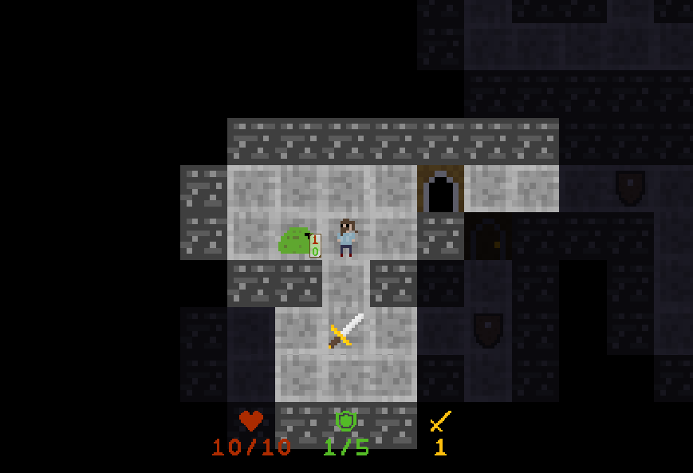

# Introduction
This project is a simple turn-based roguelike game.
Its goal is to provide the basic functionality of this game type while keeping it as simple as possible
(sometimes even sacrificing the game's performance).

The game uses the [freeglut library](http://freeglut.sourceforge.net/) for simplified OpenGL implementation and
the stb_image.h file from [stb library](https://github.com/nothings/stb) for PNG file support.
A detailed code description links can be found at the bottom of this page.

## Compiling

#### Windows
The code includes a VS2017 project file which can be used to easily compile a Windows executable.
The [freeglut 3.0.0 MSVC Package](https://www.transmissionzero.co.uk/software/freeglut-devel/) is required as an external
dependency and needs to be set in the project's linker settings (Additional Library Dependencies).

#### Linux
A Linux executable can be created using the provided Makefile. Compile files can be cleaned using *make clean* target
and the executable can have debug symbols stripped using *make clean*. 

The freeglut dependency can be added using *apt-get install freeglut3-dev* command.

## Running the game
In order to correctly run the game a correct file structure must be mantained: place the folder "resources" next to the game executable
(the folder can be found inside the project folder). 

If you are using the **Windows** build also place the freeglut.dll file next to the executable.
For **Linux** make sure the *freeglut3* package is installed on your system.

## Code description
`This section is incomplete.`
#### General informations
- [The main loop and GLUT callbacks](docs/1general/main_loop.md)
- [Vectors](docs/1general/vectors.md)
- [Textures](docs/1general/textures.md)
- [Sprites](docs/1general/sprites.md)
- [Debug logging](docs/1general/debug.md)

#### OpenGL setup
- [Game window](docs/2opengl/window.md)
- [Camera](docs/2opengl/camera.md)
- [Rendering]()

#### Graphics and effects
- [Tile visibility]()
- [Particles]()

#### Game logic
- [Raycast]()
- [User inputs]()
- [Game states]()
- [Movement animation]()
- [Enemies]()
- [Items]()
- [Interactable objects]()
- [Player death and game restart]()

#### UI
- [Text]()
- [Elements positioning]()
- [Options]()
- [Message popup]()