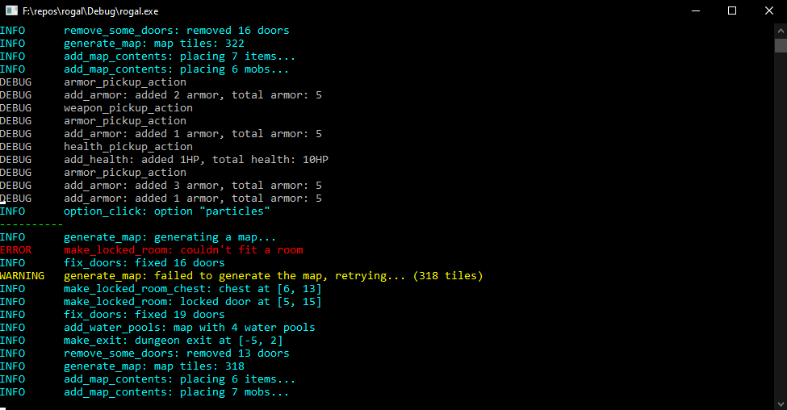

## Debug logging
One of the most crucial parts of game development (and software development in general) is the ability
to see the exact program's result and all the informations about errors during program's execution. For that
reason a convenient debug message module was implemented in this project ([logging.c](../../rogal/source/logging.c)).



#### Console colour macros
Because the console colours are applied differently on Linux and Windows the defined macros have to be picked
when the code is being built on a selected platform. This allows a convenient use of the macros later in the code.
Example for the red colour:

```c
#ifdef WIN32
#define CLR_RED SetConsoleTextAttribute(hOutput, 0xC) //Windowws uses a function
#else
#define CLR_RED printf("\033[31m") //Linux only needs a special printf command
#endif // WIN32
```

#### Debug messages
The void __d_printf(int type, const char *format, ...)__ function allows printing messages using formatted string
and a variable arguments list. The string format is applied using *vsnprintf* function from *stdarg.h*. After that
the console colour is set according to message type and a message prefix is added. Last but not least the formatted
string is printed.

- Previous article: [Sprites](sprites.md)
- Next article: [Setting up the game window]()